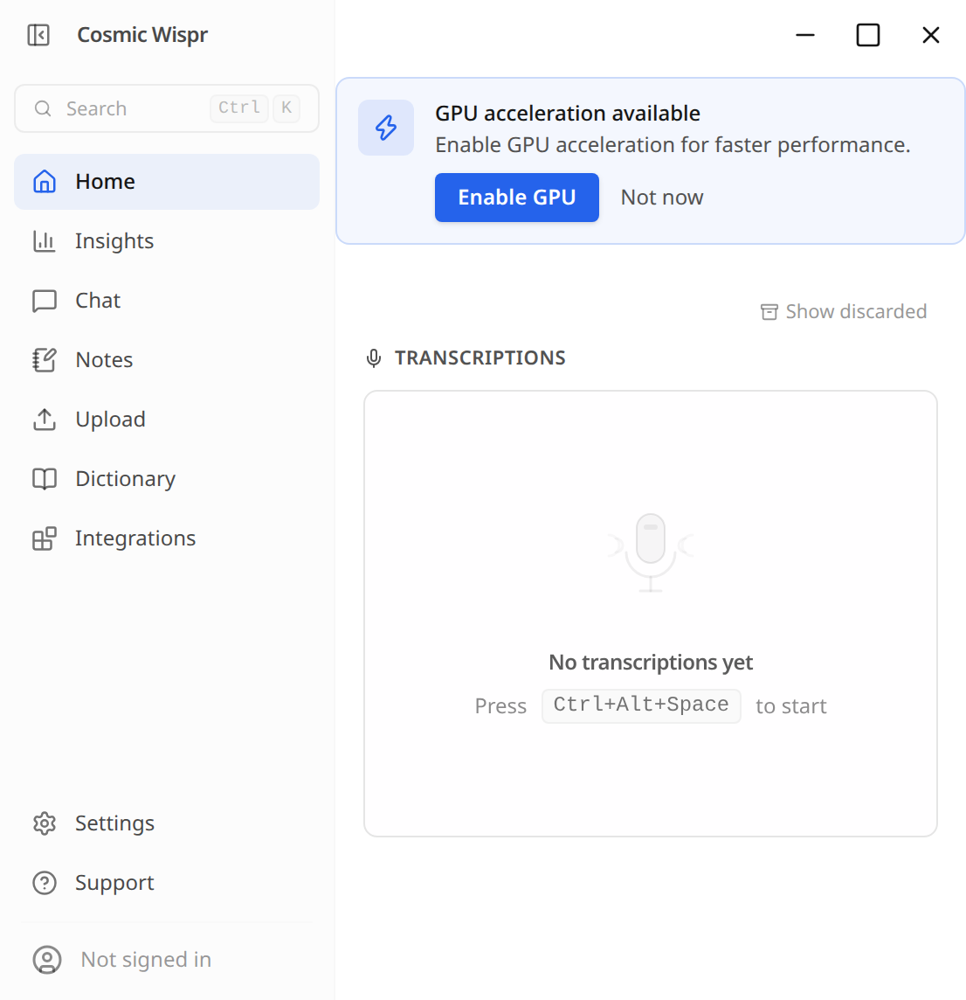

# Cosmic Wispr

Local-first AI voice dictation for the **COSMIC desktop on Linux**, built from [OpenWhispr](https://github.com/OpenWhispr/openwhispr) 1.10.0.

Click a text field in your application, press **Ctrl+Alt+Space**, speak, and press the shortcut again. Cosmic Wispr transcribes your speech, optionally cleans it up with an AI model, and pastes the result into the focused application.

This is an independent MIT-licensed fork. It is not affiliated with System76, Wispr Flow, or the OpenWhispr cloud service. Upstream copyright and license notices are retained in [LICENSE](LICENSE); the original documentation is in [docs/UPSTREAM_README.md](docs/UPSTREAM_README.md).



See [workstation validation](docs/COSMIC_VALIDATION.md) for the tested scope.

## COSMIC integration

- Native COSMIC custom shortcuts dispatch to a session D-Bus service. Shortcuts work across Wayland and XWayland applications without a global key listener.
- **Ctrl+Alt+Space** defaults to tap once to record, tap again to finish. Change it in Settings.
- **Right Ctrl** adds hold-to-talk and double-tap hands-free recording after a [one-time helper installation](docs/RIGHT_CTRL.md). Enable or disable it in Settings → Hotkeys.
- Existing desktop shortcut conflicts are reported. The app preserves unrelated bindings and backs up an existing custom shortcut file before its first change. Closing the app removes its own bindings.
- A focusless recording overlay keeps the destination application active. Native Linux input injection pastes clipboard text into that application.
- The desktop launcher is named **Cosmic Wispr**. The existing assistant, translation, and meeting features remain available; assign their optional shortcuts in Settings.

Applications must have an editable, focused field and accept clipboard paste. Protected fields, remote sessions, and applications with unusual paste behavior may require manual paste. This fork does not promise compatibility with every application.

## Run from this checkout

Use Node.js 24 or newer. On Debian/Ubuntu, native helper compilation needs a C/C++ compiler and X11/XTest development headers (`build-essential`, `libx11-dev`, `libxtst-dev`). Install `wl-clipboard` for native Wayland clipboard support.

```sh
npm ci
npm run compile:linux-paste
npm run download:whisper-cpp
npm run download:llama-server
npm run download:sherpa-onnx
npm run build:renderer
npm run install:cosmic
npm run start:cosmic
```

The installer writes a launcher in `~/.local/bin` and a desktop entry in your user application directory. It points to this checkout and the current Node executable: keep both in place. This is a source installation, not a standalone release package. No administrator privileges or login-group changes are made by the installer.

For automatic paste on native Wayland, the native helper needs write access to `/dev/uinput`. The app also retains upstream paste fallbacks. Access policy is distribution-specific; do not make the device world-writable. Ctrl+Alt+Space itself does not require input-device access.

Choose local setup during onboarding, download a speech model, and optionally select a local cleanup model. Whisper Base and Qwen3.5 2B Q4 are a small starting configuration. Models download separately from the inference executables above. Larger models trade memory and latency for quality. Upstream provider choices remain available, but its hosted account service requires a separately configured cloud backend.

For the RTX 5090 laptop's speed-focused configuration, see [local model timing and GPU setup](docs/FAST_TRANSCRIPTION.md).

## Fork boundaries

Cosmic Wispr stores its production settings in `~/.config/cosmic-wispr`, model cache in `~/.cache/cosmic-wispr`, keyring entry under `Cosmic Wispr`, and CLI bridge descriptor in `~/.cosmic-wispr`. `COSMIC_WISPR_CACHE_ROOT` can override the default model cache. Development channels use separate settings directories.

Automatic application updates are disabled until this fork has its own release feed. The packaging configuration contains no upstream publishing destination or signing credentials. Original internal module names and service names remain where changing them would break upstream compatibility.

COSMIC shortcut handling follows the [COSMIC settings daemon binding format](https://github.com/pop-os/cosmic-settings-daemon/blob/master/config/src/shortcuts/binding.rs). Unsupported configuration syntax is rejected instead of overwritten.

## Development checks

```sh
npm run test:desktop
npm run lint
npm run typecheck
npm run build:renderer
```

`test:desktop` runs the Node test runner with Electron's Node runtime, matching the native SQLite module installed by `npm ci`. `npm test` remains available for environments that build native dependencies for standalone Node.
