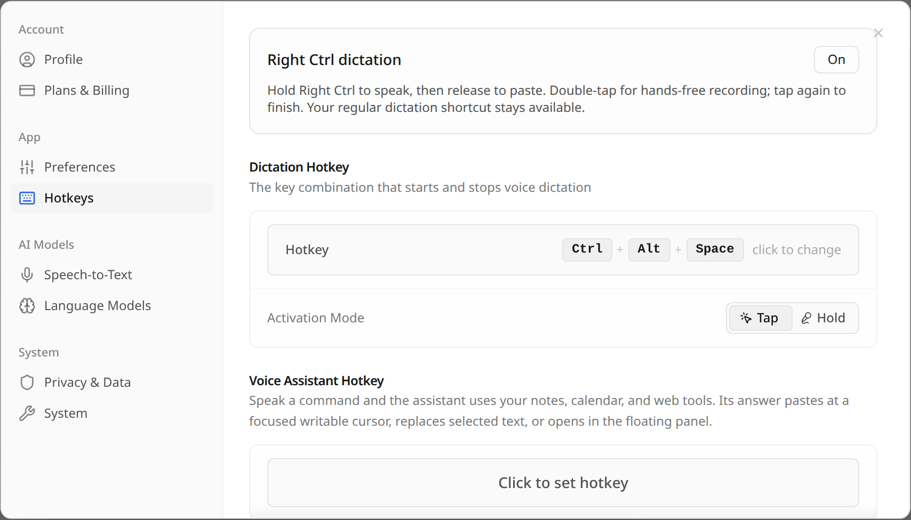

# Right Ctrl dictation on COSMIC

Right Ctrl adds a second dictation control alongside your existing shortcut:

- Hold for at least 200 ms to record. Release to transcribe and paste.
- Double-tap within 350 ms for hands-free recording; tap again to finish.
- A single brief tap does nothing when idle.
- Using another key with Right Ctrl cancels a pending or held dictation instead of pasting. During hands-free recording, ordinary Ctrl combinations preserve the recording. Normal Ctrl combinations are not intercepted.
- Recording is limited to five minutes. Disconnecting the helper, losing input synchronization, switching away from the active desktop, or locking the session cancels a recording it started.

Settings → Hotkeys → **Right Ctrl dictation** turns this control on or off. The usual Ctrl+Alt+Space shortcut continues to work independently.



## One-time setup

For a source installation, install the systemd development headers (`libsystemd-dev` on Debian/Ubuntu) along with the compiler, then run:

```sh
npm run compile:cosmic-keys
npm run install:cosmic-keys
```

The second command opens the desktop's administrator authentication dialog. It installs a root-owned executable in `/usr/local/libexec/cosmic-wispr/right-ctrl` and two systemd units, `cosmic-wispr-keys.socket` and `cosmic-wispr-keys@.service`. No logout or user group changes are needed. Restart Cosmic Wispr after updating the app; it connects automatically to an installed helper.

The socket is accessible only to the installing desktop account. A service process is started only while a client is connected, runs as an isolated dynamic user with input-device read access, and terminates when the client disconnects. Its output is limited to fixed gesture/status messages. It never grabs the keyboard, forwards typed text, or injects keystrokes. It checks logind's active graphical session and lock state before dispatching gestures. Cosmic Wispr itself receives no access to raw keyboard devices.

## Remove

Turn off Right Ctrl in the app, then disable the helper:

```sh
sudo systemctl disable --now cosmic-wispr-keys.socket
sudo rm /etc/systemd/system/cosmic-wispr-keys.socket /etc/systemd/system/cosmic-wispr-keys@.service
sudo rm /usr/local/libexec/cosmic-wispr/right-ctrl
sudo systemctl daemon-reload
```

Replaced installer files are backed up with a `.previous` suffix. Installing for another user replaces the socket's owner; this initial setup supports one desktop account.

## Developer verification

```sh
npm run test:cosmic-keys
npm run test:desktop
npm run typecheck
npm run lint
npm run build:renderer
```

Native tests cover modifier combinations, repeat suppression, typing between taps, and multiple keyboards. Gesture tests cover hold/release, double-tap, cancellation, timeout, busy-state gating, and fallback recording. A real Unix socket test verifies framing, lock/unavailability cancellation, disconnect cleanup, and the saved on/off setting.

The full desktop suite passed with 3,780 passing tests, no failures, 23 skips, and one todo. After the final hands-free Ctrl-shortcut correction, all 12 gesture/socket tests passed again. Native tests, lint, formatting, TypeScript, locale consistency, and the production renderer build also passed.

On September 9, 2026, the installed socket-activated helper was tested with synthesized Right Ctrl events through Linux's input subsystem. Hold/release and double-tap/tap both recorded a known sample and pasted into a separate native Wayland GTK4 text field. Right Ctrl+C did not start recording. The Settings switch was tested off/on with successful helper reconnection. Input/session filtering is covered by native and socket tests; a physical lock/unlock cycle was not exercised.

The final app launch uses the real microphone without test capture flags or a debugging port. See [transcription timing](FAST_TRANSCRIPTION.md) for the measured model configuration and accuracy limits.
